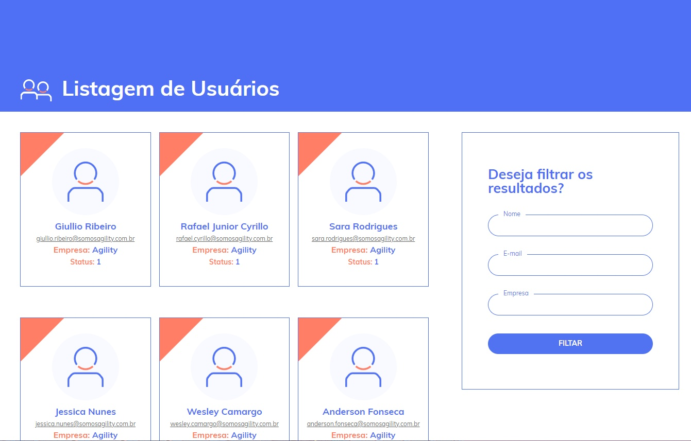

## Sobre o projeto

Este projeto foi desenvolvido como desafio para a vaga de desenvolvedor na [Agility](https://www.somosagility.com.br/). 

O desafio objetivo da aplicação é consumir dois end-points que retornam objetos JSON com as informações de usuários. Essas informações devem ser re-ordenadas e retornados ao usuário em um HTML. O usuário deve também ser capaz de filtrar os resultados.

## Sobre o design
Como a criação do design era livre, tentei criar elementos compatíveis com a filosofia de design do site da empresa. 

  

## Checklist
[x] Request dos dados nos dois end-points da API;

[x] Manipulação e ordenação alfabética dos usuários de acordo com a empresa;

[x] Criação do design da página no front-end;

[x] Renderização dos usuários em seus respectivos cards;

[x] Destaque nos usuários da Agility, que recebem uma flag laranja em seus cards;

[x] Implementação da filtragem dos resultados pelo Nome, Empresa ou E-mail do usuário;

[x] Responsividade;

[x] Subir o código no Github;

## Executando a aplicação
git clone https://github.com/eMatheus23/teste-agility

cd agility

composer install

php artisan serve

## License
The Laravel framework is open-sourced software licensed under the [MIT license](https://opensource.org/licenses/MIT).

